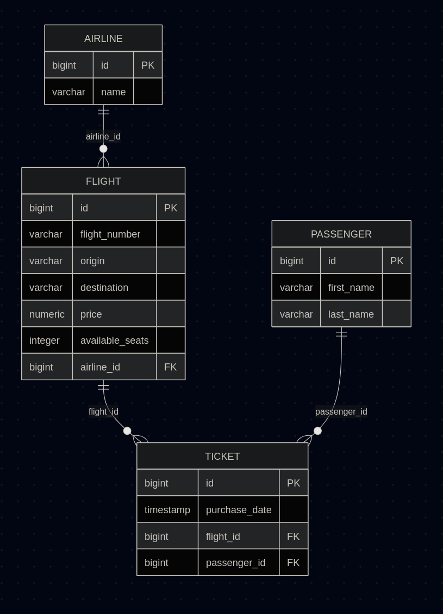

✈️ Rest Plane Ticket System - Dokumentacja Projektu

System typu REST API do zarządzania rezerwacjami biletów lotniczych, zbudowany w oparciu o framework Spring Boot 3 i bazę danych PostgreSQL.
1. Architektura Systemu

Projekt został zaprojektowany w architekturze warstwowej:

* Controller: Obsługa żądań HTTP.
* Service: Logika biznesowa.
* Repository: Komunikacja z bazą danych (Spring Data JPA).
* Model (Entity): Definicja struktur danych.

2. Wymagania systemowe
* Java: wersja 17 lub nowsza.
* Docker: do uruchomienia bazy danych.
* Gradle: do budowania projektu.

3. Instrukcja uruchomienia
Krok 1: Baza danych (Docker)

Uruchom kontener z bazą danych PostgreSQL poniższym poleceniem:
```bash
docker run --name flight-db -e POSTGRES_PASSWORD=postgres -e POSTGRES_DB=flight_system -p 5432:5432 -d postgres
```

Zaloguj sie i stworz baze "flight_system"
```bash
psql -U postgres -h localhost -p 5432 
```
```sql
create database flight_system;
```
       
Wgraj testowe dane [pobierz tutaj](./resources/placeholderData.sql):
```bash
psql -U postgres -h localhost -p 5432 < placeholderData.sql
```

Krok 2: Konfiguracja aplikacji

Plik src/main/resources/application.properties powinien zawierać:

```java
spring.datasource.url=jdbc:postgresql://127.0.0.1:5432/flight_system
spring.datasource.username=postgres spring.datasource.password=postgres
spring.jpa.hibernate.ddl-auto=update
spring.jpa.show-sql=true
```
Krok 3: Start aplikacji

W głównym katalogu projektu wykonaj:
```bash
./gradlew bootRun
```

Aplikacja będzie dostępna pod adresem: http://localhost:8080

4. Model Danych (UML)

System opiera się na relacjach:

* Airline (1:N) Flight
* Flight (1:N) Ticket
* Passenger (1:N) Ticket

5. Dokumentacja API
📡 Lista Endpointów API

System opiera się na standardowych operacjach CRUD dla czterech głównych zasobów. Domyślny prefiks to /api.
🏢 Linie Lotnicze (/api/airlines)

    GET /api/airlines – Pobiera listę wszystkich linii lotniczych.

    GET /api/airlines/{id} – Pobiera szczegóły konkretnej linii.

    POST /api/airlines – Tworzy nową linię lotniczą (Body: {"name": "string"}).

    PATCH /api/airlines/{id} – Aktualizuje nazwę linii (Body: {"name": "new_name"}).

    DELETE /api/airlines/{id} – Usuwa linię lotniczą.

🛫 Loty (/api/flights)

    GET /api/flights – Pobiera listę wszystkich lotów.

    GET /api/flights/{id} – Pobiera szczegóły lotu.

    POST /api/flights – Tworzy nowy lot (wymaga przypisania airline_id).

    PATCH /api/flights/{id} – Częściowa aktualizacja lotu (np. price, availableSeats).

    DELETE /api/flights/{id} – Usuwa lot.

👤 Pasażerowie (/api/passengers)

    GET /api/passengers – Pobiera listę pasażerów.

    POST /api/passengers – Rejestruje nowego pasażera (Body: {"firstName": "string", "lastName": "string"}).

    GET /api/passengers/{id} – Pobiera dane pasażera.

🎫 Bilety (/api/tickets)

    GET /api/tickets – Pobiera listę wszystkich wystawionych biletów.

    POST /api/tickets – Generuje bilet dla pasażera na konkretny lot.

    GET /api/tickets/{id} – Pobiera szczegóły biletu.


7. Przykładowe testy

Dodanie linii lotniczej: curl -X POST http://localhost:8080/api/airlines -H "Content-Type: application/json" -d "{"name": "LOT"}"

Aktualizacja ceny lotu (ID: 1): curl -X PATCH http://localhost:8080/api/flights/1 -H "Content-Type: application/json" -d "{"price": 450.0}"

Plik do testów w postman: [pobierz](./resources/FlightSystemPostman.json)

8 .UML


